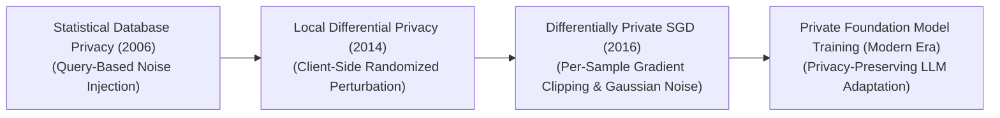
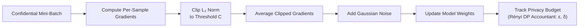

  

# 🛡️ Awesome-Differential-Privacy
## 🔒 Differential Privacy in AI: History, Progression, Variants, & Applications

**Differential Privacy (DP)** is a mathematically rigorous, cryptographic validation framework designed to guarantee strong data privacy protections during the training and deployment of Artificial Intelligence systems. Formalized by Cynthia Dwork, Frank McSherry, Kobbi Nissim, and Adam Smith in 2006, Differential Privacy provides a quantifiable upper bound on the amount of personal information an adversary can extract from an AI model. 

Structurally, DP ensures that the output distribution of an algorithm is practically invariant to the presence or absence of any single individual's record within the training dataset. By injecting mathematically calibrated noise into data queries, optimization gradients, or terminal logits, DP guarantees that a model learns universal statistical trends without accidentally memorizing or leaking the private, unique attributes of a specific individual, effectively neutralising membership inference and reconstruction attacks.

---

## 🕰️ 1. The Macro Chronological Evolution

The implementation of mathematical privacy protection has transitioned from flat tabular database querying to decentralized local noise injections, private gradient descents, and modern foundation model fine-tuning enclaves.

| Era | Concept | Limitation / Significance | Year First Used | Paper Link |
|---|---|---|---|---|
| [**The Tabular Query Perturbation Era (Statistical Databases, 2006–2013)**](pages/tabular_query_perturbation.md) | The theoretical genesis of the field. Early applications focused on securing macro statistical databases (e.g., census registries or hospital demographic spreadsheets). Security layers intercepted external database queries, adding calibrated noise to global mathematical aggregations (like `SUM` or `COUNT` operations) based on the **Global Sensitivity** of the query function. | *Limitation:* Confined to static, structured tabular lookups, collapsing when scaled to multi-layered, non-linear machine learning parameters or high-dimensional unstructured data inputs. | 2006 | [Dwork et al., 2006](#references) |
| [**The Local Differential Privacy Era (Client-Side Randomization, ~2014–2015)**](pages/local_dp_era.md) | Shifted the privacy intervention straight to the user's local hardware device, completely eliminating the need for a trusted central database manager. Popularized by systems like Google's RAPPOR and Apple's telemetry trackers, **Local Differential Privacy (LDP)** forces the client device to run randomized response algorithms (e.g., flipping a virtual coin to decide whether to report true telemetry or random noise) *before* streaming metrics to corporate analytics servers. | *Limitation:* Introduces severe statistical utility decay. Because noise is added independently by millions of disconnected clients, aggregating the records requires extreme data volumes to filter out the background noise, introducing communication overheads. | 2014 | [Erlingsson et al., 2014](#references) |
| [**The Private Optimization Gradient Era (DP-SGD, 2016–2023)**](pages/dp_sgd_era.md) | Sparked the modern private deep learning boom. Introduced by Abadi et al., **Differentially Private Stochastic Gradient Descent (DP-SGD)** integrated mathematical privacy directly into the model's backpropagation loop. During each training batch step, the framework executes a two-part execution safeguard: 1. *Per-Sample Clipping:* Restricts the maximum $L_2$ norm of each individual data point's gradient vector to a fixed threshold ($C$). 2. *Gaussian Noise Addition:* Injects mathematically calibrated Gaussian noise directly into the averaged batch gradient before updating weights. | *Significance:* Successfully mapped differential privacy straight to large-scale deep neural networks (CNNs, Transformers), providing mathematically certified privacy boundaries across millions of parameter weight adjustments. | 2016 | [Abadi et al., 2016](#references) |
| [**The Foundation Model Fine-Tuning & Distillation Era (~2024–Present)**](pages/foundation_model_era.md) | The current modern state-of-the-art production baseline engineered to secure massive foundation models. Standard DP-SGD breaks down when applied to training massive 70B+ networks from scratch because gradient noise scales poorly with immense parameter counts. Modern architectures isolate the pre-training and alignment lifecycles. Models are pre-trained on vast, public, non-sensitive data corpuses without noise restrictions to establish robust language and logic features. | *Significance:* DP-SGD is deployed exclusively within tiny, localized post-training loops—such as tuning Parameter-Efficient Adapters (**LoRA / QLoRA**) or training **Sparse Autoencoders (SAEs)** [INDEX: 2] over confidential private enterprise data repositories. This preserves high utility and reasoning capabilities while guaranteeing tight privacy boundaries ($\epsilon < 1$). | 2022 | [Li et al., 2022](#references) |

---

## ⚙️ 2. Core Functional & Algorithmic Variants

Differential Privacy implementations are strictly categorized based on the exact structural location where the noise perturbation is injected across the data ecosystem.

| Variant | Mechanism | Pros | Cons | Year First Used | Paper Link |
|---|---|---|---|---|---|
| [**A. Central Differential Privacy (Global DP)**](pages/central_dp.md) | Raw, unaltered user records are collected and stored inside a centralized data warehouse. The privacy framework adds calibrated noise strictly to the final computed outputs, parameters, or models when exporting files or providing API access to external clients. | Maximizes the performance utility of the model because noise is applied globally and efficiently. | Requires users to maintain absolute, unwavering trust in the central cloud hosting provider's internal security parameters. | 2006 | [Dwork et al., 2006](#references) |
| [**B. Local Differential Privacy (LDP)**](pages/local_dp.md) | The user's device injects noise into telemetry logs or text strings right at the source before data ever enters a network wire. The central cloud server only ever ingests heavily randomized, noisy, and partially corrupted data arrays. | Eliminates the trusted-central-server vulnerability completely. | Demands massive data scaling pools to extract valid global statistics, degrading model precision heavily on small-batch conditions. | 2014 | [Erlingsson et al., 2014](#references) |
| [**C. Differentially Private SGD (DP-SGD)**](pages/dp_sgd.md) | Intercepts the internal backpropagation matrix during deep model optimization. It computes independent gradients per data sample, clips their vector magnitudes to a maximum cap ($C$), and blends in a calibrated Gaussian noise tensor ($\sigma \cdot C$) before execution weight adjustments finalize. | Offers certified, provable mathematical tracking bounds against membership inference exploits. | N/A | 2016 | [Abadi et al., 2016](#references) |

---

## 🧮 3. The Privacy Accounting & Renyi DP Matrix

To verify and balance mathematical privacy leakage over extended training timelines, automated optimization loops run continuous information-tracking subroutines.

| Parameter / Concept | The Math | Year First Used | Paper Link |
|---|---|---|---|
| [**The $\epsilon$-Privacy Budget Dial (Pure DP)**](pages/epsilon_budget.md) | The parameter $\epsilon$ (Epsilon) tracks the absolute maximum privacy leakage bound. It dictates the ratio ceiling of an algorithm outputting a specific pattern between two adjacent datasets differing by only one individual's record. Setting $\epsilon \rightarrow 0$ guarantees perfect privacy but erases all model utility; standard high-security corporate environments deploy targets where $\epsilon \le 1.0$ to $4.0$. | 2006 | [Dwork, 2006](#references) |
| [**The $\delta$-Failure Probability Cap (Approximate DP)**](pages/delta_probability.md) | The parameter $\delta$ (Delta) represents a tiny, strict margin of error tolerance ($1/\text{dataset size}$) mapping out the minor statistical probability that the model could completely violate the epsilon boundary, ensuring catastrophic privacy leaks are bounded. | 2006 | [Dwork et al., 2006](#references) |
| [**Rényi Differential Privacy (RDP Accounting)**](pages/renyi_dp.md) | An advanced generalization based on Rényi divergence. Traditional privacy accounting scales poorly when composition tracking loops run over thousands of mini-batch optimization steps, outputting overly pessimistic, loose privacy bounds. RDP tracks moments of the privacy loss distribution directly, allowing compilers to compute extremely tight, accurate cumulative privacy bounds ($\epsilon, \delta$) over long foundation training runs. | 2017 | [Mironov, 2017](#references) |

---

## 🏗️ 4. Production Engineering Challenges & Hardware Solutions

Translating theoretical differential privacy constraints onto standard parallel computing architectures introduces intense processing latencies and optimization bottlenecks.

| Challenge | The Problem | Mitigation | Year First Used | Paper Link |
|---|---|---|---|---|
| [**The Per-Sample Gradient Tracking Memory Wall**](pages/memory_wall.md) | Standard deep learning frameworks (like native PyTorch or TensorFlow graphs) are hardwired to aggregate and average individual data row gradients into a single batch tensor instantly during the forward/backward pass to maximize GPU Tensor Core parallelization. DP-SGD requires tracking and clipping *each individual data sample's gradient independently* before averaging. Doing this via naive software loops disables hardware acceleration, multiplying training latency by up to $10\times$ to $100\times$ and triggering memory crashes. | Implementing **Fused Vectorized Op Compilers (such as Opacus or OpenAI Triton extensions)**, which utilize JIT-compilation to calculate and clip per-sample gradients concurrently inside fast on-chip GPU SRAM registers, recovering up to $90\%$ of standard dense training speeds. | 2021 | [Yousefpour et al., 2021](#references) |
| [**The Noise-Induced Gradient Clipping Capability Collapse**](pages/capability_collapse.md) | Constantly clipping gradient lengths to a rigid threshold ($C$) and blending in Gaussian noise acts as a severe structural regularization constraint. It erases low-magnitude long-tail data features, causing the model to experience **Capability Collapse**—where it completely loses the ability to perform complex downstream reasoning, read rare text syntaxes, or identify niche medical pathologies. | Shifting infrastructure workflows toward **Public Pre-training with Private Fine-tuning**, leveraging frozen foundation backbones to handle heavy feature representations while deploying DP-SGD strictly over small low-rank adapters (LoRA layers), minimizing the parameter footprint exposed to noise. | 2022 | [Li et al., 2022](#references) |

---

## 🚀 5. Frontier Real-World AI Security Applications

| Application Area | Application Details | Year First Used | Paper Link |
|---|---|---|---|
| [**Privacy-Sovereign Financial Risk and Anti-Money Laundering Training**](pages/financial_aml.md) | Coordinates multi-institution distributed banking model optimization. High-throughput DP-SGD networks allow independent banking clusters to collaboratively train cross-border asset-tracking and fraud-detection layers over highly confidential, private user account transaction webs without violating strict regional financial privacy regulations or leaking private user tracking records. | 2016 | [Abadi et al., 2016](#references) |
| [**HIPAA-Compliant Clinical Pathology & Genomic Diagnostic Research**](pages/clinical_genomic.md) | Optimizes computer vision and sequence transformers over highly sensitive medical records (e.g., patient cancer tissue scans or private DNA sequences). Differentially private training layers ensure medical diagnostic models internalize accurate pathology classification paths safely, allowing cross-institutional medical networks to distribute diagnostic assistance models globally with zero risk of patient record re-identification or data reconstruction attacks. | 2016 | [Abadi et al., 2016](#references) |
| [**Decentralized Consumer Telemetry and Local Text Autocomplete Scaling**](pages/decentralized_telemetry.md) | Powers consumer device local keyboard text predictors and smartphone assistant telemetry trackers (e.g., Apple iOS and Google Android pipelines). Local Differential Privacy (LDP) randomized response algorithms randomize typing metrics directly on the consumer's local hardware device, letting corporate analytics servers securely aggregate global trending slang vocabulary frequencies without ever capturing private user credit card digits or passcodes. | 2014 | [Erlingsson et al., 2014](#references) |

---

## 📚 References
1. Dwork, C., McSherry, F., Nissim, K., & Smith, A. (2006). Calibrating noise to sensitivity in private data analysis. *Theory of Cryptography Conference*, 265-284.
2. Dwork, C. (2006). Differential privacy. *International Automata, Languages and Programming (ICALP) Conference*, 1-12.
3. Erlingsson, Ú., Pihur, V., & Korolova, A. (2014). RAPPOR: Randomized aggregatable privacy-preserving ordinal response. *Proceedings of the 2014 ACM SIGSAC Conference on Computer and Communications Security*, 1054-1067.
4. Abadi, M., et al. (2016). Deep learning with differential privacy. *Proceedings of the 2016 ACM SIGSAC Conference on Computer and Communications Security*, 308-318.
5. Mironov, I. (2017). Rényi differential privacy. *IEEE 30th Computer Security Foundations Symposium (CSF)*, 263-275.
6. Yousefpour, A., et al. (2021). Opacus: User-friendly differential privacy in PyTorch. *arXiv preprint arXiv:2109.12298*.
7. Li, X., et al. (2022). Large language models can be strong differentially private learners. *International Conference on Learning Representations (ICLR)*.

---

To advance this documentation repository, secure post-training architecture, or privacy-preserving MLOps automation pipeline, consider exploring these adjacent development pathways:
* Build a **Python script using PyTorch and Opacus** illustrating how to wrap a standard linear model layer graph inside a private `PrivacyEngine` loop to compute automated Epsilon budget consumption tracking.
* Generate a **comprehensive Markdown table** explicitly comparing Central Differential Privacy (Global DP), Local Differential Privacy (LDP), Differentially Private SGD (DP-SGD), and Functional Output Perturbation across mathematical privacy boundaries ($\epsilon, \delta$), lifecycle optimization points, infrastructure computational cost overheads, and downstream model utility retention profiles.
* Establish a **performance evaluation harness using Triton** to track the exact computational throughput, VRAM cache allocations, and memory bus latency metrics achieved when compiling a fused per-sample gradient clipping operations patch directly inside high-speed GPU SRAM registers.

***

**Follow-Up Navigation Matrix:**

Before updating this documentation layout, let me know how you would like to proceed by choosing one of the options below:
* I can provide a **complete Python code boilerplate using PyTorch** demonstrating how to write an automated script that calculates exact Gaussian noise calibration scales given a targeted global sensitivity cap.
* I can generate a **Markdown matrix table** tracking the explicit privacy budgets ($\epsilon$), failure thresholds ($\delta$), and gradient clipping limits utilized by leading industrial platforms to deploy secure customer-facing endpoints.
* I can write a detailed technical explanation focusing on the **mathematical proof of the Composition Theorem** and how multi-step training loops impact the global information leakage boundaries under Rényi privacy parameters.

