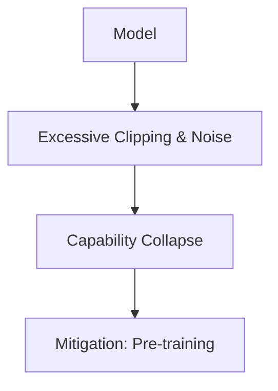

# Noise-Induced Capability Collapse

Detailed information about Noise-Induced Capability Collapse and its relevance to differential privacy.

```mermaid
flowchart TD
    A[Model] --> B[Excessive Clipping & Noise]
    B --> C[Capability Collapse]
    C --> D[Mitigation: Pre-training]
```
