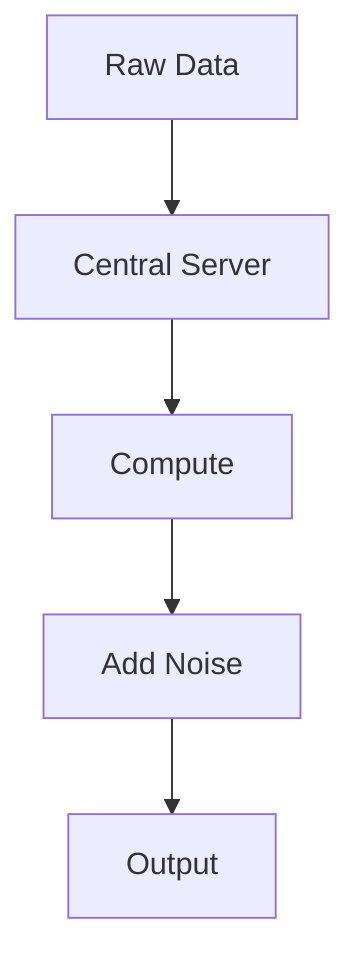

# Central Differential Privacy

Detailed information about Central Differential Privacy and its relevance to differential privacy.

```mermaid
flowchart TD
    A[Raw Data] --> B[Central Server]
    B --> C[Compute]
    C --> D[Add Noise]
    D --> E[Output]
```
