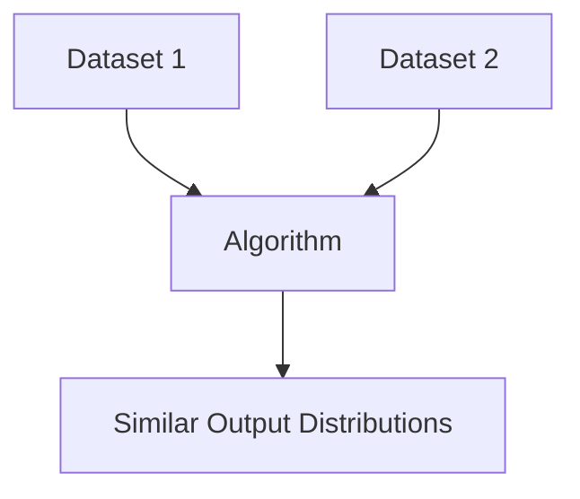

# Epsilon Privacy Budget

Detailed information about Epsilon Privacy Budget and its relevance to differential privacy.

```mermaid
flowchart TD
    A[Dataset 1] --> B[Algorithm]
    C[Dataset 2] --> B
    B --> D[Similar Output Distributions]
```
