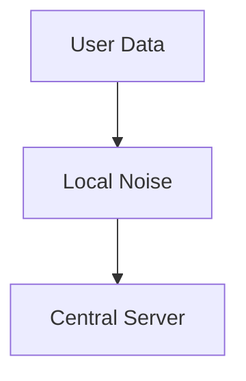

# Local Differential Privacy

Detailed information about Local Differential Privacy and its relevance to differential privacy.

```mermaid
flowchart TD
    A[User Data] --> B[Local Noise]
    B --> C[Central Server]
```
