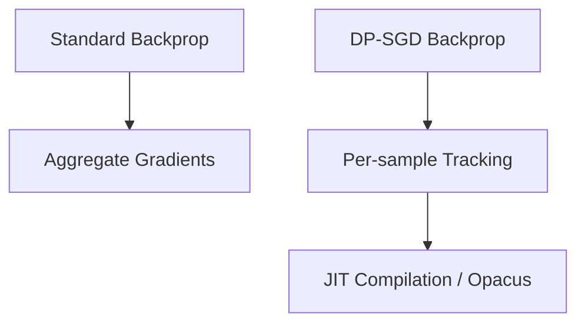

# Per-Sample Gradient Tracking Memory Wall

Detailed information about Per-Sample Gradient Tracking Memory Wall and its relevance to differential privacy.

```mermaid
flowchart TD
    A[Standard Backprop] --> B[Aggregate Gradients]
    C[DP-SGD Backprop] --> D[Per-sample Tracking]
    D --> E[JIT Compilation / Opacus]
```
